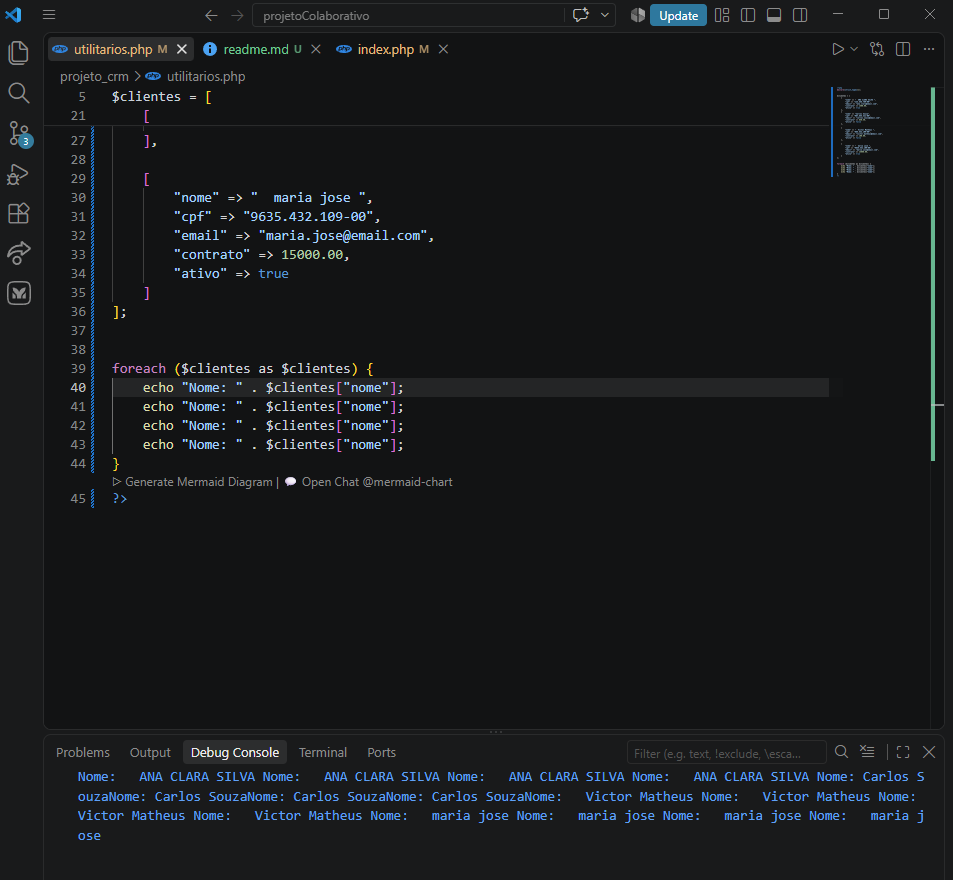
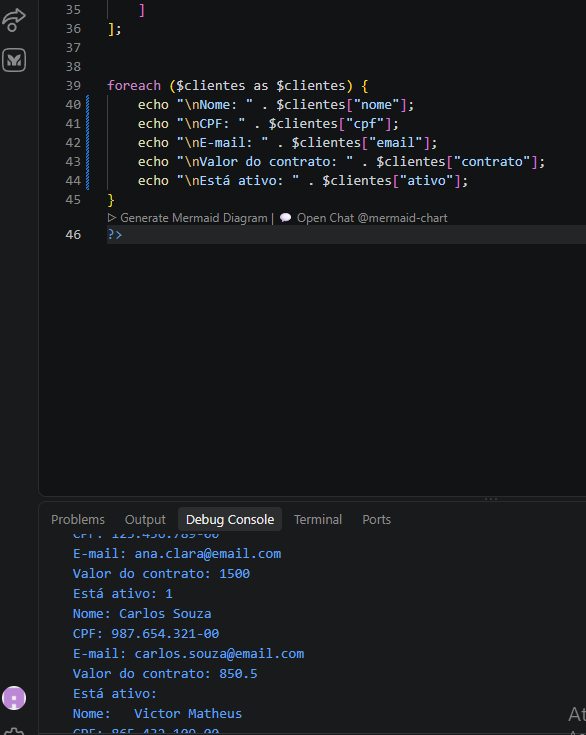
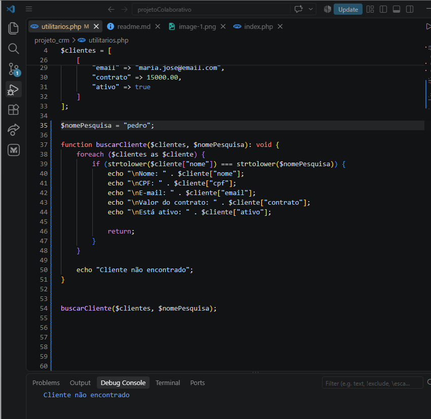
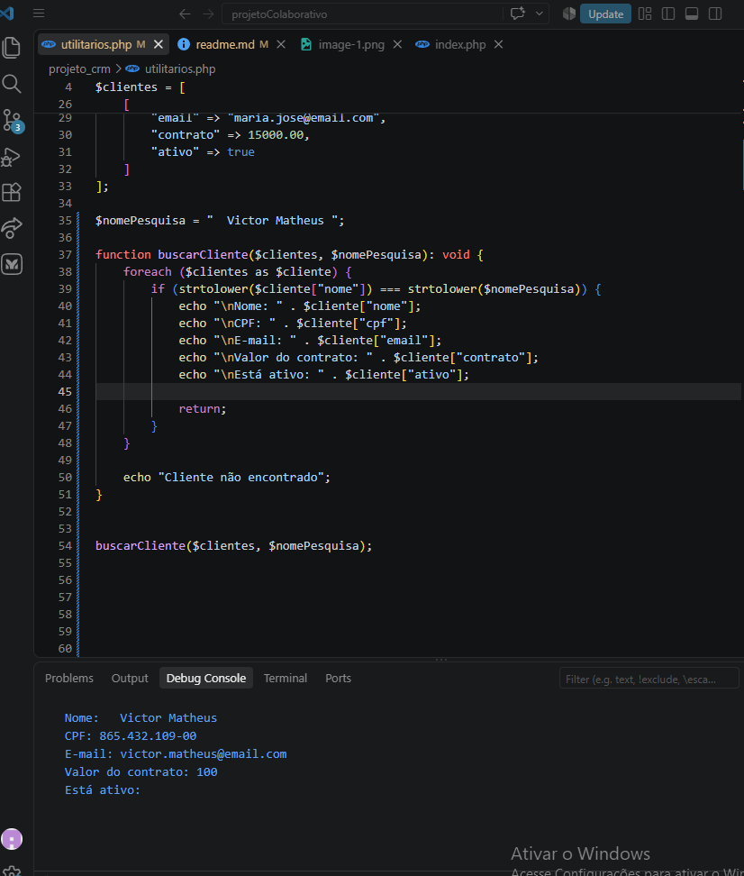
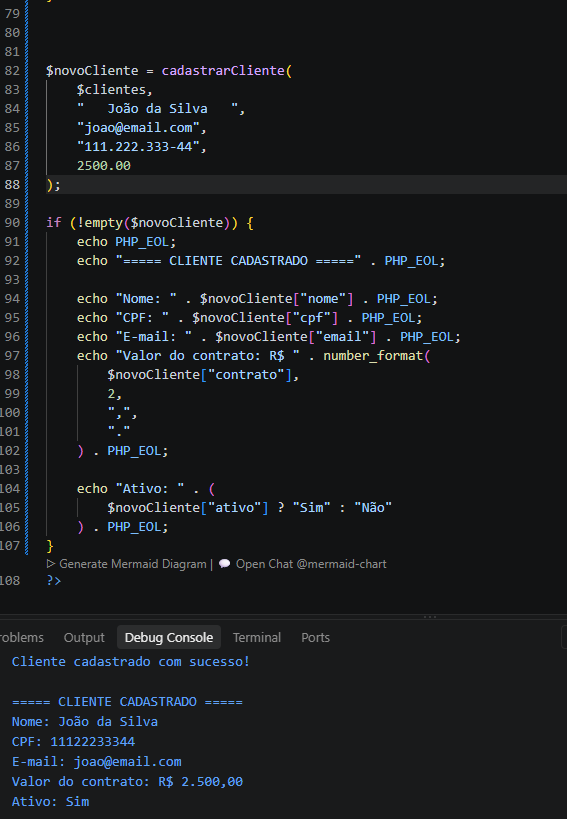
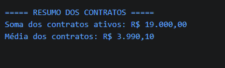
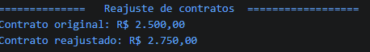

# SABP: Projeto: Central de Atendimento e Cadastro do CRM Senai

> - **Integrantes**: Hannah, Pollyanna e Victor 

## Introdução 

>Esse projeto tem como objetivo desenvolver um sistema simples em PHP para cadastrar e organizar informações de clientes. A aplicação foi criada para facilitar o controle dos dados, como nome, CPF, e-mail, valor do contrato e situação do cliente. Os dados são armazenados em um `array` e, durante o projeto, serão utilizadas funções para organizar, validar, pesquisar e apresentar essas informações de forma mais simples e organizada.

## Objetivo do projeto
>O objetivo principal do projeto é criar um sistema simples de cadastro e consulta de clientes utilizando PHP.

## Organização do Projeto
> - **Pollyanna:** ficou responsável pela documentação e pelos testes do projeto.
> - **Hannah:** ficou responsável pela descrição dos requisitos e pela preparação dos casos de teste.
> - **Victor:** ficou responsável pela criação das funções de tratamento e cálculo, além da montagem da tela HTML e da integração das funções.

### 1 - Listagem de clientes 
>  Mostrar todos os clientes usando `foreach`, com nome, CPF, e-mail, valor do contrato e situação.

>O sistema consegue fazer a verificação do nome de todos os clientes existentes em nosso banco de dados, assim, verificando apenas se aquele ususario existe ou não no sistema, mas ainda assim não mostrando suas informações.

### 2 - Busca por nome
>  Criar uma opção para pesquisar um cliente pelo nome e exibir seus dados. Informe quando o cliente não for encontrado.

>O sistema percorre todos os clientes cadastrados usando o `foreach` e mostra as informações de cada um. São exibidos o nome, CPF, e-mail, valor do contrato e a situação do cliente, indicando se ele está ativo ou não.

### 3 - Cadastro de cliente
>Permitir inserir ou simular o cadastro de um novo cliente, validando nome, e-mail, CPF e valor do contrato.

>O sistema permite pesquisar um cliente pelo nome. A função percorre todos os clientes cadastrados e compara o nome pesquisado com os nomes existentes. Quando encontra o cliente, mostra somente suas informações, como nome, CPF, e-mail, valor do contrato e situação. Neste teste, foi pesquisado o nome "Pedro", mas como ele não está cadastrado, o sistema informou **"Cliente não encontrado"**

### 4 - Limpeza de dados
>Remover espaços desnecessários dos nomes e caracteres de formatação dos CPFs.

>Neste teste, foi realizada uma pesquisa pelo nome **"Victor Matheus"**. O sistema percorreu os clientes cadastrados e encontrou o usuário. Depois disso, mostrou somente os dados desse cliente, como nome, CPF, e-mail, valor do contrato e sua situação no sistema. Isso mostra que a função de pesquisa está funcionando corretamente quando o cliente está cadastrado.

### 5 - Formatação
>Apresentar os nomes de forma padronizada e os valores no formato de moeda brasileira.

>Neste teste, foi realizado o cadastro de um novo cliente com o nome **"João da Silva"**. O sistema recebeu os dados informados, como nome, CPF, e-mail e valor do contrato, e realizou o cadastro do usuário. Depois disso, mostrou as informações desse cliente na tela, incluindo sua situação no sistema, indicando que ele está ativo. Isso mostra que a função de cadastro está funcionando corretamente e que os dados do novo cliente são apresentados após o cadastro.

### 6 - Resumo financeiro
>Calcular a soma dos contratos ativos e a média dos valores dos contratos usando funções específicas.

>Neste teste, o sistema analisou os contratos cadastrados e identificou quais estão ativos. Depois disso, calculou a soma dos valores dos contratos ativos, que resultou em R$ 19.000,00, e também calculou a média dos contratos, que ficou em R$ 3.990,10. Dessa forma, o sistema consegue apresentar um resumo financeiro dos contratos, mostrando o valor total dos contratos ativos e a média dos valores cadastrados.

### 7 - Alteração por referência
>Criar uma função que aplique um reajuste percentual em um contrato usando &, alterando o valor original do cliente.

>Neste teste, o sistema apresenta um relatório resumido dos contratos dos clientes cadastrados. Ele reúne as informações necessárias para mostrar de forma simples o valor original do contrato e o valor após o reajuste. No exemplo apresentado, o contrato que era de R$ 2.500,00 passou para R$ 2.750,00, permitindo visualizar rapidamente o resultado do reajuste aplicado aos contratos.

### 8 - Relatório final
>Exibir  a quantidade total de clientes, a quantidade de clientes ativos e o maior contrato cadastrado.

>Criamos uma página de front-end com o foco de imprimir o relatorio das funções - saindo do debug console do VScode e indo para uma página visal HTML que possa ser aberta em navegadores. Decidimos usar uma estética de documento para assim trazer uma formalidade e a simplificação para pessoas que não são da area possam entender o que aconteceu e resumir as informações para compreensão geral