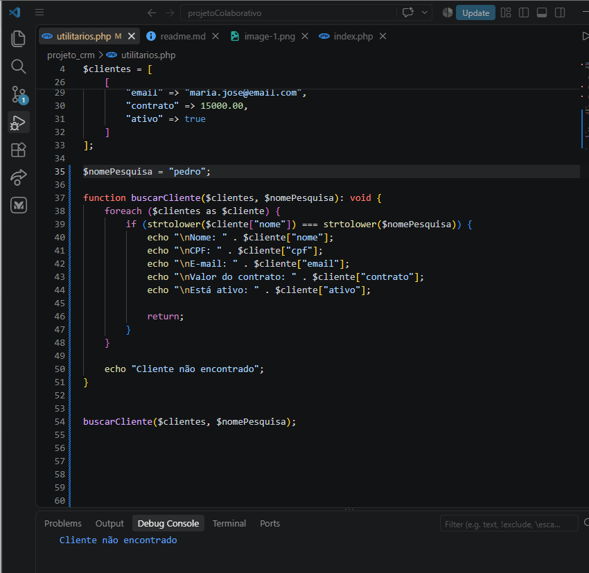
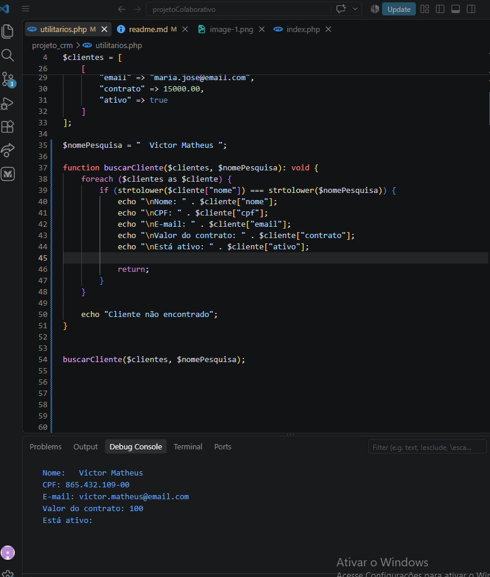
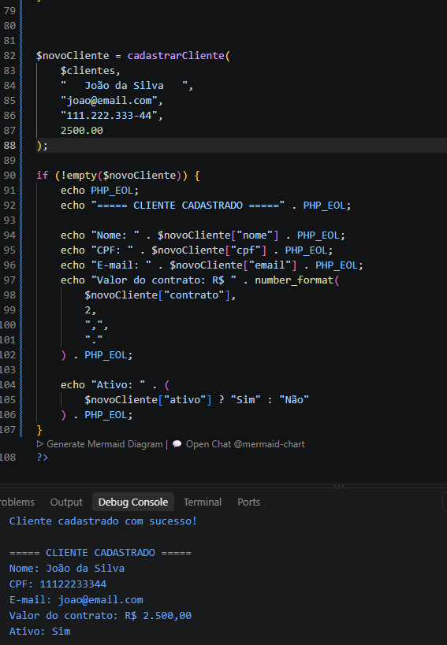
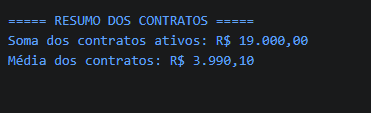
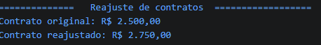

# testes

sistema reconhece todos os usuarios criados, assim imprimindo seu nome e validando sua existencia no sistema

agora imprime todas as informações do cliente

agora ele busca o cliente e informa os dados apenas do cliente que desejar. nesse caso ele não encontrou o cliente

agora ele encontrou um usuario via pesquisa

agora o sistema cria usuarios e mostra suas informações

agora calcula quantos contratos estão ativos e retorna seu valor total e a média entre eles

mostra um relatorio de todos os clientes de forma resumida

